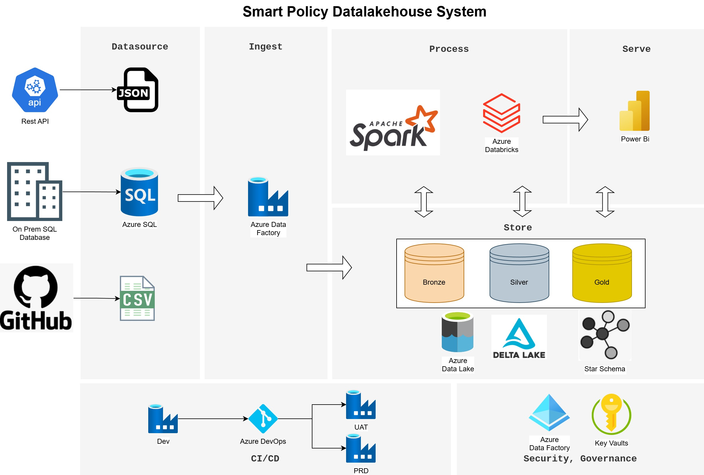

# 🚀 Smart Policy Datalakehouse System

An end-to-end data engineering pipeline for an insurance company to analyze claims data and perform customer segmentation using a modern data lakehouse architecture.

---

## 🧾 Project Summary

This project simulates the data platform of an insurance company that sells policies to retail customers. It helps the company better understand customer needs and tailor offerings accordingly through advanced analytics and segmentation.

---

## 🎯 Business Goals

- Analyze insurance claims data to uncover trends and inefficiencies.
- Segment customers based on behavior, location, and demographics.
- Provide insights to sales and underwriting teams to optimize offerings.

---

## 🏗️ Architecture Overview

This solution follows the **Medallion Architecture** to implement a scalable **Data Lakehouse** on Azure.

---

## 🧰 Tech Stack

| Layer           | Tools / Services                                      |
|-----------------|--------------------------------------------------------|
| **Sources**     | Azure SQL DB, REST API, JSON, CSV(GitHub)              |
| **Ingestion**   | Azure Data Factory                                    |
| **Processing**  | Azure Databricks (PySpark), Delta Lake (Bronze/Silver/Gold) |
| **Storage**     | ADLS Gen2, Delta Tables                               |
| **Visualization** | Power BI                                           |
| **Security**    | Azure Key Vault, Azure Active Directory               |
| **CI/CD**       | Azure DevOps                                          |

---

## 📂 Data Sources

| Source      | Format | Description               |
|-------------|--------|---------------------------|
| Policy      | JSON   | Policy records from legacy system |
| Customer    | CSV    | Retail customer records    |
| Demographics| REST API | External demographic enrichment |
| Claims, Branch, Agent | SQL (Azure SQL DB) | Core insurance operations data |

---

## ✅ Key Features

- Modular pipeline with Bronze → Silver → Gold layers
- Unified batch architecture
- Customer segmentation and total claims, Summary of Company sales,  logic using PySpark
- Secure secret handling via Key Vault
- CI/CD with Azure DevOps for pipeline deployment

